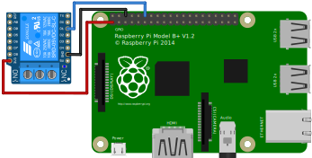

# homebridge-gpio-switch

Homebridge plugin to control relay switch via Raspberry Pi GPIO pins, for example



To install the plugin from npm

```bash
npm install -g --unsafe-perms homebridge-gpio-switch
```

See [config-sample.json](config-sample.json) for a sample accessory configuration. The pin numbering uses [GPIO pin numbering](https://www.raspberrypi.org/documentation/usage/gpio/), and not the physical pin numbering used by [rpio](https://github.com/jperkin/node-rpio) by default.

To run from source, prepare source folder

```bash
cd /home/pi
git clone https://github.com/tewarid/homebridge-gpio-switch
cd homebridge-gpio-switch
npm install --unsafe-perms
```

Point homebridge to the config and source folder

```bash
homebridge -P /home/pi/homebridge-gpio-switch/ -U /home/pi/.homebridge/
```

To run at boot, run `sudo vi /etc/rc.local` and add the following line

```bash
homebridge -P /home/pi/homebridge-gpio-switch/ -U /home/pi/.homebridge/ &
```

Reboot.
